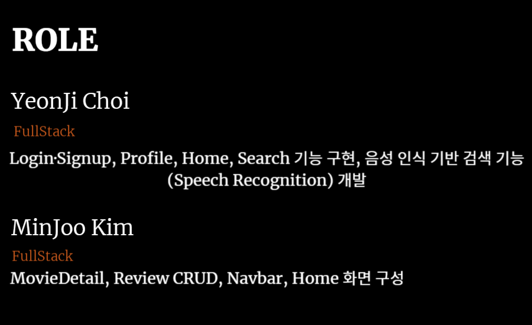

# 🎬 CINECODE(영화 추천 및 리뷰 관리 웹사이트)

 

## 목차

1. [**개요**](#✨-개요)
1. [**주요 기능**](#-주요-기능)
1. [**서비스 화면**](#)
1. [**기술 스택**](#-기술-스택)
1. [**프로젝트 진행 및 산출물**](#-프로젝트-진행-및-산출물)
1. [**개발 멤버 및 회고**](#-개발-멤버-및-역할분담)
1. [**메뉴얼 및 상세문서**](#-메뉴얼-및-상세-문서)

 

## ✨ 개요

#### Samsung Software Academy For Youth 12th - 관통 프로젝트
#### 서비스명 : CINECODE ( 똑똑한 경제 학습 )
#### 한줄 설명 : `감정 음성인식기반 영화추천 알고리즘`
#### 프로젝트 기간 : 2024.11.17 ~ 2024.11.27

## ✨ 프로젝트 소개

<h2>영화 추천 알고리즘</h2>

#### AI를 활용한 사용자 음성 인식 기반 감정 분석 추천
1. Web Speech API와 MediaRecorder API를 활용하여 사용자의 음성을 녹음하고 실시간으로 텍스트로 변환하며, 5초간의 음성 데이터를 수집합니다. (back/moveis/views.py analyze_sentiment 참고)
2. 수집된 음성 데이터는 서버로 전송되어 감정 분석(sentiment analysis)을 수행하고, 분석된 감정 점수를 기반으로 영화를 추천합니다. (back/moveis/views.py recommend_movies 참고)
3. 분석 결과는 프론트엔드에서 캐러셀 형태로 표시되며, localStorage를 통해 검색 결과를 저장하여 페이지 새로고침 시에도 이전 검색 결과를 유지합니다. (front/src/views/movies/SearchView.vue 참고)

 

## ✨ 기획 배경
사용자의 **감정 상태를 음성으로 입력 받아**,
**Google Cloud Speech-to-Text API와 Google Cloud Natural Language API**를 활용하여
**그에 맞는 영화를 추천하는 혁신적인 시스템**을 구축하고자 기획되었습니다.

또한, 영화에 대한 리뷰를 작성하고 공유할 수 있는 커뮤니티 기능을 통해
사용자 간의 **자유롭고 활발한 상호작용**을 유도하였습니다.

뿐만 아니라, **재생 상태 관리** 및 **찜하기 기능**을 통해
개인의 취향에 맞는 영화를 효율적으로 관리하고,
사용자의 **영화 감상 여정을 보다 체계적이고 개인화된 방식으로 경험**할 수 있도록 설계하였습니다.

## ✨ 주요 기능

### 1. 로그인/회원가입
 
 

### 2. 메인화면
 - 로그인 전
   

 - 로그인 후
   

### 3. 영화 상세 화면
   
   - 재생, 찜하기 상태 관리
   - 리뷰 조회(최신순/좋아요순 정렬), 작성, 좋아요 버튼

### 4. 마이페이지 화면
   
   
   
   - 리뷰 수정, 삭제, 좋아요 관리
   - 회원 정보 수정 (프로필 이미지, 닉네임, 이메일, 비밀번호 변경)

### 5. 영화 추천 및 검색
   
   - 제목으로 검색
   - 음성 인식으로 감정 분석 후 장르 기반으로 영화 추천 (화면 사진은 추후 업로드 예정)

 

 

# 📚 기술 스택

### 💻 Languages  
  
 

### 🗄️ Database  

 

### 🌐 Version Control  

 
### 🧩 Frameworks  
  
 

### 🔌 API & External Services  
    

 

## 기술적 특징

**1. 감정 인식 기반 영화 추천 시스템**
 - Web Speech API를 통해 사용자의 음성 데이터를 실시간 수집하고, Google Cloud Speech-to-Text API로 텍스트로 변환
 - 변환된 텍스트는 Google Cloud Natural Language API를 통해 감정 분석하여, 분석된 감정 점수 기반 영화 추천 로직 구현
 - 추천 로직은 Django 백엔드에서 처리되고, 결과는 Vue.js 프론트에서 캐러셀 형태로 시각화

**2.  자연어 감정 분석 기반 영화 추천 (Google Cloud API 활용)**
  - Google Cloud Natural Language API를 사용해 사용자의 음성 텍스트에서 감정 점수를 추출
  - 추출된 감정(예: joy, anger, sadness 등)에 따라 해당 감정에 맞는 영화 장르를 자동 매핑
  - 장르에 맞는 영화를 내부 DB에서 추천해주는 **감정 연동형 추천 기능** 구현

**3. SPA 구조 기반 프론트엔드(Vue.js)**

- Vue Router를 활용한 싱글 페이지 애플리케이션 구조 설계
- 컴포넌트 재사용성과 유지보수성을 고려한 UI 구조 분리
- LocalStorage를 통해 추천 결과 유지 및 사용성 향상

**4. 사용자 인증 및 상태 관리**

 - Django Auth를 기반으로 한 로그인/회원가입 기능 구현
 - 사용자 정보 수정, 리뷰 CRUD, 찜하기 등 개인화 기능 구현

**5. RESTful API 설계**

 - Django REST Framework를 사용해 API를 모듈화 및 명확한 책임 분리
 - Swagger를 통해 API 문서 자동화

## ERD

## 컴포넌트 구조도

 

## 👨‍👩‍👧‍👦 개발 멤버 및 역할분담

<table>
  <tbody>
    <tr>
      <td align="center">
        <a href="#"> 
        <b>FullStack : 최연지 rokmc17047200@gmail.com</b></a> 
      </td>
      <td align="center">
        <a href="#"> 
        <b>FullStack : 김민주 hong00zzzzzz@gmail.com</b></a> 
      </td>
    </tr>
  </tbody>
</table>
 

  
 

## 소감

 **김민주**  
 새로운 언어와 프레임워크를 사용하여 프로젝트를 제작하다보니 생각보다 어려웠던 부분도 많고 뜻대로 작동하지 않아 막막했던 순간도 많았지만, 좋은 팀원과 AI 툴(Special thanks to Cursor...) 덕분에 프로젝트를 끝까지 완성할 수 있었습니다. 이번 프로젝트가 앞으로 있을 협업과 개발자로서의 커리어에 초석을 다지는 계기가 된 것 같아 뿌듯하고 의미 있는 시간이었습니다.   
 **최연지**  
 API를 활용한 데이터 처리 과정에서 어려움이 있었지만 문제 해결을 통해 많은 지식을 습득할 수 있었습니다. 팀원과의 원활한 협업을 통해 프로젝트를 성공적으로 완수하는 큰 성취감을 느낄 수 있었습니다. 이번 프로젝트를 통해 이전보다 더 깊이 있는 경험을 쌓을 수 있었고, 실무 역량과 협업 능력을 한층 강화할 수 있었습니다. 
